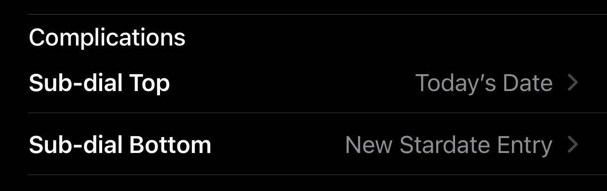

Once you've installed Stardate on your Apple Watch, you can add a little icon– called a complication –to your watch face to start a note with one tap.

Not all watch faces support complications. Stardate supports two complication types:

- **Circular** – appears in the center of the watch face.
- **Corner** – appears in one of the four corners of the watch face.

You'll need to choose a watch face that supports one of those types of complications.

## Add a complication from your phone

1. On your iPhone, open the Watch app.
2. Tap the My Watch tab.
3. Select a watch face you want to add the complication to.
4. At the bottom of the screen, you'll see options to add complications. Different watch faces support different complications.
5. Choose a complication location and search or scroll to Stardate. Select the "New Stardate Entry" complication.

## Add a complication from your watch

1. Hold down on your watch face until the edit screen appears.
2. Tap "Edit".
3. Swipe right until you see the complications screen.
4. Select a **circular** or **corner** complication.
5. Scroll to find Stardate and choose the "New Stardate Entry" complication.

import WatchBezel from "../../../components/watch_bezel.astro";
import selected_complication from "../../../assets/guides/complication-setup-watch.png";

<WatchBezel
  screenshot={selected_complication}
  alt="A circular complication on an Apple Watch"
/>

## Complication locations

Here are a couple images to help you visualize the locations of the complications.

### Circular

import circular_screenshot from "../../../assets/guides/complication-installed-circular.png";

<WatchBezel
  screenshot={circular_screenshot}
  alt="A circular complication on an Apple Watch"
/>

### Corner

import corner_screenshot from "../../../assets/guides/complication-installed-corner.png";

<WatchBezel
  screenshot={corner_screenshot}
  alt="A corner complication on an Apple Watch"
/>
