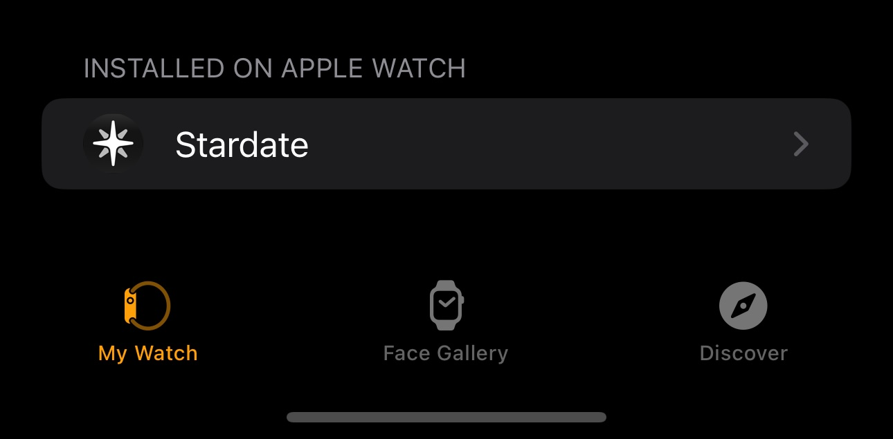
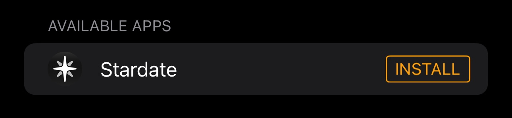

Once you've installed Stardate on your iPhone, you'll need to confirm that it's installed on your Apple Watch. It should be installed automatically, but you can also check in the Watch app on your iPhone if it's not showing up.

import { Aside } from "@astrojs/starlight/components";

<Aside type="note">
  Apple has further documentation on [installing apps on Apple Watch
  here](https://support.apple.com/en-us/109023).
</Aside>

1. On your iPhone, open the Watch app.
2. Tap the My Watch tab.
3. Search for Stardate or scroll down to the apps that you can install.

If the app is available but not installed on your Apple Watch, you may see an "INSTALL" button instead. Tap the Install button to add Stardate to your Apple Watch.

Once installed, Stardate will appear on your Apple Watch app view. Press the digital crown to access this view.

import { LinkCard } from "@astrojs/starlight/components";

<LinkCard
  title="Start a note with one tap"
  description="Now you can add a complication to your watch face to start a note with one tap!"
  href="/guides/apple-watch-complications"
/>
