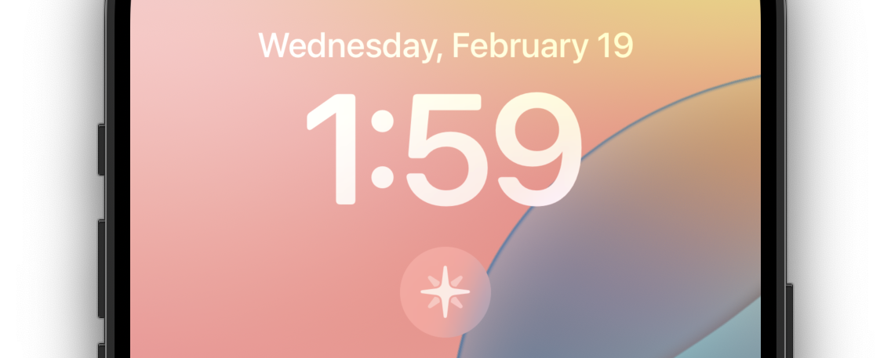
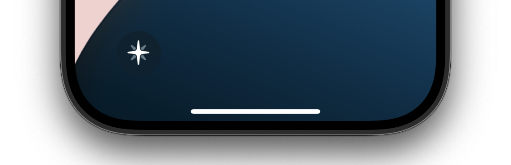
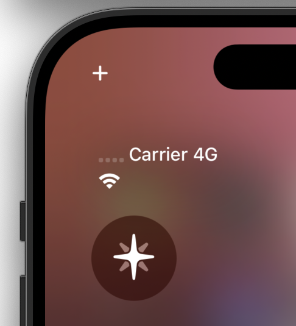

You can also add Stardate to your lock screen or control center to quickly start a new note from your iPhone. The "New Entry" widget opens the Stardate app and starts a new note automatically.

This document will show you what that looks like, and link to Apple's documentation on how to add these features to your iPhone.

## Lock Screen Widgets

Up at the top of the screen, under the clock.

In the corner of the screen, replacing either the camera or the flashlight.

Apple's documentation on adding a widget to your lock screen is here:

- [Adding a widget to your Lock Screen](https://support.apple.com/guide/iphone/create-a-custom-lock-screen-iph4d0e6c351/18.0/ios/18.0#iphf41752ab8)

## Control Center

Apple's documentation on adding a Control Center control is here:

- [Adding a Control Center control](https://support.apple.com/guide/iphone/use-and-customize-control-center-iph59095ec58/18.0/ios/18.0#iph83c5f986c)
